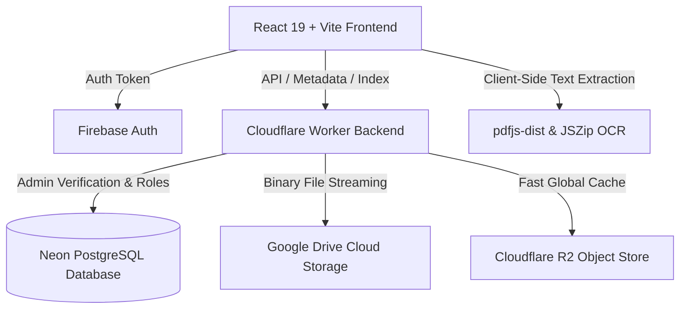

# RIT Library

[](https://github.com/shashianand25/ritlibrary/actions/workflows/ci.yml)
[](https://opensource.org/licenses/ISC)
[](https://reactjs.org/)
[](https://vitejs.dev/)
[](https://vitest.dev/)

A modern, high-performance academic resource portal and syllabus tracker for students at Ramaiah Institute of Technology (RIT). Provides seamless indexing, document extraction, search filtering, and contribution workflows for course materials, previous year examination question papers (PYQs), and lecture notes.

---

## 🏛 System Architecture



---

## ✨ Key Features

- 🔍 **Guided & Code-Based Search**: Instant filtering across branches (CS, AI/ML, IS, EC, ME, etc.), semesters, and electives.
- ⚡ **Client-Side Text Extraction**: Built-in support to extract and copy text from PDF and PowerPoint (PPTX) documents directly in the browser without server bottlenecks.
- 📤 **Resource Contribution**: Direct-to-storage upload pipeline supporting large binary payloads with progress tracking.
- 🛡 **Role-Based Admin Management**: Dynamic database-backed administrator role assignment powered by Neon PostgreSQL.
- 📊 **Syllabus Progress Tracker**: Localized preparation tracker with graceful offline recovery and progress metrics.
- 📡 **Observability & Metrics**: Structured JSON logging with request correlation IDs, `/api/health` availability checks, `/api/metrics` Prometheus runtime telemetry, and Web Vitals client performance monitoring.
- 🧪 **Comprehensive Automated Testing**: 100% test pass rate with Vitest, React Testing Library, and V8 coverage enforcement.

---

## 📁 Repository Structure

```
ritlibrary/
├── .github/
│   ├── workflows/ci.yml          # GitHub Actions CI (Lint, Test, Build)
│   └── dependabot.yml           # Automated dependency update configuration
├── .devcontainer/               # VS Code Remote Devcontainer configuration
├── Dockerfile                   # Multi-stage production container build
├── docker-compose.yml           # Local container orchestration
├── my-project/                  # Frontend Single Page Application (SPA)
│   ├── src/
│   │   ├── __tests__/           # Unit and component test suites
│   │   ├── components/          # Modular UI, search, and contribution components
│   │   ├── utils/               # File parsers, structured logger, validators
│   │   ├── lib/                 # Firebase Auth context and client SDK
│   │   └── data/                # Static subject maps and syllabus JSON data
│   ├── vitest.config.js         # Vitest test runner configuration
│   ├── eslint.config.js         # ESLint 9 flat configuration
│   └── .env.example             # Frontend environment variables template
└── library-backend/             # Serverless Cloudflare Worker API
    ├── src/index.js             # Worker router, Postgres adapter, Drive proxy
    ├── wrangler.jsonc           # Cloudflare Worker configuration
    └── .env.example             # Backend environment variables template
```

---

## 🚀 Quick Start

### Prerequisites
- Node.js `20.x` or higher
- npm `10.x` or higher
- (Optional) Docker and Docker Compose

### 1. Local Development Setup

```bash
# Clone the repository
git clone https://github.com/shashianand25/ritlibrary.git
cd ritlibrary

# One-step automated workspace setup (installs all dependencies & initializes .env templates)
npm run setup
```

### 2. Start Development Servers

```bash
# Start frontend application
npm run dev

# In another terminal, start the Cloudflare Worker API
npm --prefix library-backend run dev
```

---

## 🧪 Automated Testing & Quality Checks

Run the automated test suite and verification pipelines:

```bash
# Run all unit & component tests
npm run test

# Run tests with code coverage analysis
npm run test:coverage

# Run ESLint validation
npm run lint

# Check code formatting with Prettier
npm run format:check

# Auto-format all source code
npm run format

# Run clean production build
npm run build
```

---

## 🐳 Running with Docker

Run the entire application in a standardized container:

```bash
# Build and run with Docker Compose
docker-compose up --build -d

# Open in browser at http://localhost:3000
```

---

## 🔐 Environment Variables Reference

| Variable | Scope | Description |
| :--- | :--- | :--- |
| `VITE_WORKER_URL` | Frontend | URL of the deployed Cloudflare Worker API |
| `VITE_FIREBASE_API_KEY` | Frontend | Firebase Web API Key for authentication |
| `DATABASE_URL` | Backend | PostgreSQL connection string (Neon Serverless) |
| `ADMIN_EMAILS` | Backend | Comma-separated bootstrap administrator emails |
| `DRIVE_ROOT_ID` | Backend | Google Drive target folder ID for stored resources |

See [`my-project/.env.example`](my-project/.env.example) and [`library-backend/.env.example`](library-backend/.env.example) for exact templates.

---

## 🤝 Contributing

1. Fork the repository and create a feature branch (`git checkout -b feature/amazing-feature`).
2. Commit your changes with accompanying tests (`git commit -m 'Add amazing feature with unit tests'`).
3. Ensure all tests pass (`npm run test && npm run lint`).
4. Push to the branch (`git push origin feature/amazing-feature`).
5. Open a Pull Request.

---

## 📜 License

Distributed under the ISC License. See `LICENSE` for details.
